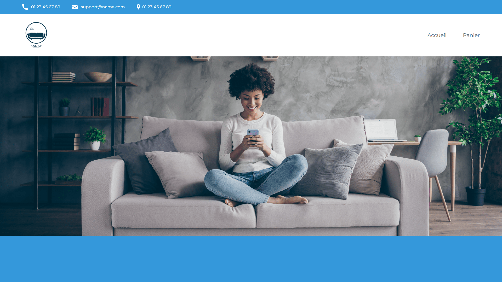

<div align="center">  
    <a href="https://kanap-vm.vercel.app/" target="_blank">  
        
    </a>
    </br>  
    </br>  
  <h3 align="center">🛋️ Kanap - Projet Scolaire</h3>  
</div>

## <br /> 📌 Sommaire

&nbsp;&nbsp;&nbsp; 🎨 &nbsp; [**Introduction**](#introduction)<br />
&nbsp;&nbsp;&nbsp; 🛠️ &nbsp; [**Technologies**](#technologies)<br />
&nbsp;&nbsp;&nbsp; 🎯 &nbsp; [**Fonctionnalités**](#fonctionnalités)<br />
&nbsp;&nbsp;&nbsp; 🚧 &nbsp; [**Mise à Jour**](#upgrade)<br />
&nbsp;&nbsp;&nbsp; 🚀 &nbsp; [**Installation**](#installation)<br />

## <br /> <a name="introduction">🎨 Introduction</a>

Ce projet consiste à développer un site e-commerce en JavaScript Vanilla, mettant en avant des fonctionnalités dynamiques et une expérience utilisateur fluide sans dépendre de frameworks externes. Le site intègre une architecture simple et efficace, avec des affichages dynamiques de produits, une gestion du panier via localStorage, et un design responsive en HTML et CSS.

📂 Pour plus de détails, consultez le [dossier](/.docs/).

## <br /> <a name="technologies">🛠️ Technologies</a>

- Frontend : HTML, CSS et JavaScript pur pour un affichage dynamique des produits et un design responsive.
- Backend : Node.js et Express pour la gestion du serveur et la création d'une API REST.

## <br /> <a name="fonctionnalités">🎯 Fonctionnalités</a>

- Affichage dynamique des produits via des requêtes à l'API.
- Gestion du panier en temps réel avec localStorage pour une expérience utilisateur fluide.
- Validation avancée des formulaires grâce aux REGEX, garantissant des entrées sécurisées.
- Interface responsive, optimisée pour tous les écrans.

## <br /> <a name="upgrade">🚧 Mise à Jour</a>

J'ai apporté des améliorations au projet initial afin de le rendre déployable :

- Refonte de l'architecture pour une meilleure organisation et évolutivité.
- Déploiement du backend sur Render pour une gestion efficace des ressources.
- Hébergement du frontend sur Vercel pour des performances optimales.

## <br /> <a name="installation">🚀 Installation</a>

### ✅ Pré-requis

🛠️ [**Git**](https://git-scm.com/) &nbsp;&nbsp;
🔧 [**Node.js**](https://nodejs.org/fr) &nbsp;&nbsp;
📦 [**npm**](https://www.npmjs.com/)

### 📥 Cloner le projet

```bash
git clone git@github.com:ValentinMadiot/kanap-ecommerce_api.git
```

### 📦 Installer les dépendances /api

```bash
npm install
```

### ▶️ Lancer le backend en local

```bash
npm start
```

Le serveur sera accessible à l'adresse : http://localhost:4200

### 🖥️ Lancer le projet

Utilisez Live Server pour un rechargement en temps réel.
